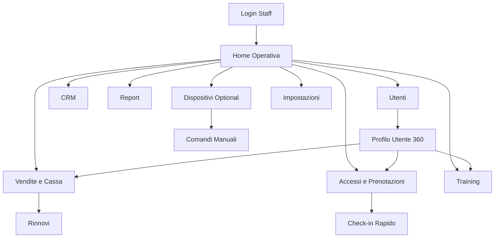

# Dashboard Web - Documento Completo Layout, Pagine e Flow

## 0) Scopo del documento
Definire in modo univoco la struttura della dashboard web staff del gestionale palestre, includendo:
- layout globale;
- sezioni e sottosezioni della sidebar;
- contenuto obbligatorio di ogni pagina;
- flow operativi end-to-end;
- regole di visibilita per ruolo.

Ambito: dashboard web staff (non mobile).

---

## 1) Layout globale della dashboard

## 1.1 Struttura base schermo
La dashboard usa un layout a 4 zone:
1. `Sidebar sinistra` (navigazione primaria, collassabile).
2. `Topbar` (ricerca globale, selettore sede, notifiche, profilo operatore).
3. `Main content` (pagina corrente: KPI, tabelle, form, timeline, builder).
4. `Right rail opzionale` (alert realtime, task urgenti, scorciatoie operative).

## 1.2 Grid e comportamento
- Desktop >= 1280 px: sidebar aperta + content + right rail opzionale.
- Laptop 1024-1279 px: sidebar compatta, right rail in drawer.
- Tablet 768-1023 px: sidebar a overlay, topbar con quick actions ridotte.
- Mobile web staff: non target primario (solo fallback di consultazione).

## 1.3 Pattern UI condivisi
Pattern obbligatori trasversali:
- `KPI card` (valore, delta, trend, filtro tempo).
- `Data table` (filtri, sort, paginazione, azioni riga).
- `Master-detail` (lista a sinistra, dettaglio a destra o in drawer).
- `Sticky action bar` (azioni primarie in fondo pagina/form).
- `Modal di conferma critica` (rimborsi, sblocco dispositivo, annulli).
- `Alert banner` (errore, warning, successo, info) sempre in cima al content.

## 1.4 Elementi persistenti topbar
La topbar deve contenere sempre:
- ricerca globale (utente, ricevuta, prenotazione, dispositivo, documento);
- selettore sede/filiale;
- pulsante notifiche con badge;
- menu attivita recenti;
- switch ruolo (se utente multi-ruolo);
- avatar operatore.

## 1.5 Stati di pagina obbligatori
Ogni pagina deve avere almeno questi stati:
- loading;
- empty state guidato (con CTA);
- errore recoverable (retry);
- errore bloccante (fallback + support id);
- permesso negato (403 role based).

---

## 2) Sidebar: sezioni e sottosezioni complete

## 2.1 Albero IA completo (versione canonical)
```text
01 Home
   01.1 Panoramica Operativa
   01.2 Task Prioritari
   01.3 Alert Realtime

02 Utenti
   02.1 Ricerca Utenti
   02.2 Nuovo Utente
   02.3 Utenti Attivi
   02.4 Utenti Bloccati
   02.5 Abbonamenti in Scadenza
   02.6 Richieste Disdetta
   02.7 Profilo Utente 360 (pagina dettaglio)
       02.7.1 Timeline
       02.7.2 Anagrafica
       02.7.3 Abbonamenti
       02.7.4 Pagamenti
       02.7.5 Documenti e Consensi
       02.7.6 Prenotazioni
       02.7.7 Training e Misure
       02.7.8 Accessi e Dispositivi
       02.7.9 Note Interne

03 Accessi e Prenotazioni
   03.1 Monitor Accessi Live
   03.2 Storico Accessi
   03.3 Gestione Prenotazioni Corsi
   03.4 Gestione Prenotazioni Servizi
   03.5 Regole Accesso e Crediti
   03.6 Check-in Rapido (scanner/desk)

04 Vendite e Cassa
   04.1 Nuova Vendita (POS)
   04.2 Listino Abbonamenti
   04.3 Listino Pacchetti/Servizi
   04.4 Prodotti Shop
   04.5 Pagamenti e Ricevute
   04.6 Rinnovi
   04.7 Rimborsi e Storni

05 Training
   05.1 Modelli Scheda
   05.2 Builder Scheda Allenamento
   05.3 Libreria Esercizi
   05.4 Piani Assegnati
   05.5 Misurazioni e Valutazioni

06 CRM e Comunicazioni
   06.1 Lead e Pipeline
   06.2 Segmenti Utenti
   06.3 Campagne
   06.4 Automazioni
   06.5 Messaggi 1:1
   06.6 Template Comunicazioni

07 Report e Analytics
   07.1 Dashboard KPI
   07.2 Report Vendite
   07.3 Report Accessi/Frequenza
   07.4 Report Prenotazioni/No-show
   07.5 Report Retention/Churn
   07.6 Export e Report Salvati

08 Dispositivi (Optional)
   08.1 Stato Dispositivi
   08.2 Comandi Manuali
   08.3 Regole Device Access
   08.4 Log Eventi e Audit
   08.5 Configurazione Controller

09 Impostazioni
   09.1 Sedi e Orari
   09.2 Team Operatori
   09.3 Ruoli e Permessi
   09.4 Branding e App
   09.5 Metodi di Pagamento
   09.6 Modelli Documento
   09.7 Integrazioni API/Webhook
   09.8 Preferenze Sistema
```

## 2.2 Sezioni sticky (sempre visibili)
In fondo sidebar:
- `+ Nuova Vendita` (quick action);
- `+ Nuovo Utente`;
- `Sblocca Tornello` (se modulo IoT attivo e permesso presente).

## 2.3 Visibilita per ruolo (sintesi)
| Sezione | Admin | Manager | Reception | Coach | Marketing | Operatore tecnico |
|---|---|---|---|---|---|---|
| Home | full | full | full | custom | custom | custom |
| Utenti | full | full | full | limitato ai propri clienti | solo segmenti/lettura | no dati sensibili |
| Accessi/Prenotazioni | full | full | full | prenotazioni corsi assegnati | lettura | solo accessi tecnici |
| Vendite/Cassa | full | full | full | no | no | no |
| Training | full | full | lettura | full | no | no |
| CRM | full | full | base | no | full | no |
| Report | full | full | base | training report | marketing report | device report |
| Dispositivi | full | view | no | no | no | full |
| Impostazioni | full | parziale | no | no | no | solo tecniche |

---

## 3) Specifica pagina per pagina

## 3.1 Home > Panoramica Operativa
Obiettivo: dare stato giornaliero filiale e priorita operative.

Blocchi obbligatori:
1. KPI principali (accessi oggi, incassi oggi, rinnovi in scadenza, prenotazioni prossime 2h).
2. Coda task prioritari (certificati, pagamenti falliti, disdette, no-show).
3. Alert realtime (accessi negati, device offline, picchi affluenza).
4. Shortcut operativi (nuovo utente, nuova vendita, check-in rapido, apri ticket).

Azioni principali:
- apri dettaglio utente;
- apri task in modal/drawer;
- completa task e logga operatore.

## 3.2 Utenti > Ricerca/Lista
Obiettivo: trovare velocemente qualsiasi utente.

Blocchi obbligatori:
1. Filtri rapidi (nome, telefono, stato abbonamento, certificato, sede).
2. Tabella utenti (anagrafica minima + stato + ultima attivita).
3. Azioni riga (apri profilo 360, nuova vendita, check-in manuale).

## 3.3 Utenti > Nuovo Utente
Obiettivo: onboarding anagrafico rapido e controllato.

Step wizard:
1. Dati anagrafici.
2. Consensi privacy.
3. Documento identita e certificato.
4. Associazione piano/vendita iniziale.
5. Abilitazione app + invio credenziali.

Vincoli:
- salvataggio bozza;
- validazioni in-line;
- audit su override campi critici.

## 3.4 Utenti > Profilo Utente 360
Obiettivo: avere tutta la storia utente in una sola pagina.

Header fisso:
- nome, foto/avatar, stato utente, stato abbonamento, certificato, crediti servizi.

Quick actions sticky:
- Nuova vendita;
- Registra pagamento;
- Prenota corso;
- Sblocca varco (permesso);
- Invia comunicazione.

Tab obbligatori:
1. `Timeline`: eventi utente ordinati per data.
2. `Anagrafica`: dati, contatti, note reception.
3. `Abbonamenti`: attivi/storico, scadenze, sospensioni.
4. `Pagamenti`: scadenze, transazioni, ricevute/storni.
5. `Documenti e Consensi`: certificati, contratti, firme.
6. `Prenotazioni`: corsi/servizi, no-show, cancellazioni.
7. `Training e Misure`: schede assegnate, progressi, anamnesi.
8. `Accessi e Dispositivi`: ingressi validi/negati, device events.
9. `Note Interne`: note staff con tagging e visibilita ruolo.

## 3.5 Accessi e Prenotazioni > Monitor Accessi Live
Obiettivo: gestire ingresso in tempo reale.

Blocchi obbligatori:
1. Feed live accessi (utente, varco, esito, motivo).
2. Pannello esiti negati (motivo codificato e azione consigliata).
3. Comandi rapidi (check-in manuale, sospendi blocco temporaneo).

Regole:
- ogni override deve richiedere motivazione;
- log con timestamp e operatore.

## 3.6 Accessi e Prenotazioni > Gestione Prenotazioni
Obiettivo: vista operativa corsi e servizi.

Blocchi:
1. Calendario risorse (giorno/settimana).
2. Occupazione posti in tempo reale.
3. Waiting list e promozione automatica.
4. Limiti di cancellazione e penalita.

## 3.7 Vendite e Cassa > Nuova Vendita (POS)
Obiettivo: emissione vendita rapida e sicura.

Layout:
1. Selezione utente (o walk-in).
2. Carrello vendita (abbonamenti, pacchetti, servizi, prodotti).
3. Promozioni/sconti con policy.
4. Pagamento (metodo, rate, esito gateway).
5. Emissione documento fiscale/ricevuta.

Azioni critiche:
- sconto extra;
- annullo;
- storno.
Richiedono permesso + conferma.

## 3.8 Vendite e Cassa > Pagamenti e Ricevute
Obiettivo: controllo economico e recupero crediti.

Blocchi:
1. Lista pagamenti con filtri avanzati.
2. Stato incasso (ok/fallito/in attesa).
3. Dettaglio ricevuta e ristampa.
4. Pannello azioni: sollecito, rateizzazione, rimborso.

## 3.9 Training > Modelli Scheda
Obiettivo: gestire libreria template standard.

Blocchi:
1. Tabella modelli (obiettivo, difficolta, durata, target).
2. Filtri per segmento utente.
3. Azioni: duplica, archivia, pubblica.

## 3.10 Training > Builder Scheda
Obiettivo: costruire o personalizzare schede.

Blocchi:
1. Struttura giorni/slot.
2. Inserimento esercizi/circuiti/superserie.
3. Parametri serie/ripetizioni/tempi/recuperi.
4. Note coach e criteri adattamento.
5. Preview PDF + invio app.

## 3.11 Training > Misurazioni e Valutazioni
Obiettivo: tracciare progressi antropometrici.

Blocchi:
1. Storico misure (timeline).
2. Grafici trend e benchmark.
3. Scheda anamnesi con scadenze aggiornamento.
4. Alert gap dati (misure non aggiornate).

## 3.12 CRM e Comunicazioni > Lead e Pipeline
Obiettivo: convertire lead in iscritti.

Blocchi:
1. Kanban pipeline (nuovo contatto -> trattativa -> chiuso).
2. Task follow-up con SLA.
3. Provenienza lead.
4. Conversion report.

## 3.13 CRM e Comunicazioni > Campagne
Obiettivo: comunicazioni massive segmentate.

Blocchi:
1. Segmento target.
2. Canale (push/email/SMS/WhatsApp).
3. Template + variabili.
4. Scheduler invio.
5. KPI campagna (delivery/open/click/conversion).

## 3.14 Report e Analytics > Dashboard KPI
Obiettivo: controllo gestionale multiprospettiva.

Widget minimi:
- MRR/ricavi giornalieri;
- rinnovi;
- churn;
- frequenza media;
- no-show;
- saturazione corsi.

## 3.15 Report e Analytics > Export
Obiettivo: produrre report condivisibili.

Blocchi:
1. Report predefiniti.
2. Report custom salvabili.
3. Esportazione CSV/XLS/PDF.
4. Storico export e permessi download.

## 3.16 Dispositivi (Optional) > Stato Dispositivi
Obiettivo: monitor salute infrastruttura.

Blocchi:
1. Lista device per sede/zona.
2. Stato online/offline/latenza.
3. Ultimo heartbeat.
4. Ticket tecnico contestuale.

## 3.17 Dispositivi (Optional) > Comandi Manuali
Obiettivo: azioni remote controllate.

Blocchi:
1. Selezione device.
2. Tipo comando (apri, reset, abilita sessione).
3. Motivazione obbligatoria.
4. Conferma a doppio passaggio.

Vincolo:
- comando idempotente;
- log completo (utente, ruolo, device, motivo, esito).

## 3.18 Dispositivi (Optional) > Regole e Log
Obiettivo: policy di accesso e audit.

Blocchi:
1. Regole per fascia oraria e ruolo utente.
2. Regole consumo crediti servizi.
3. Log immutabile eventi device.
4. Ricerca incidenti e replay cronologico.

## 3.19 Impostazioni > Team, Ruoli e Permessi
Obiettivo: gestire RBAC e governance.

Blocchi:
1. Ruoli standard + custom role.
2. Matrice permessi azione/modulo.
3. Scope sede/filiale.
4. Simulazione "cosa vede questo ruolo".

## 3.20 Impostazioni > Integrazioni
Obiettivo: configurare sistemi esterni.

Blocchi:
1. Gateway pagamenti.
2. Integrazione badge/QR.
3. API key e webhook.
4. Log errori integrazione.

---

## 4) Flow di navigazione e processi

## 4.1 Flow generale di navigazione


## 4.2 Flow E2E: nuovo iscritto
Attore principale: reception.

1. `Utenti > Nuovo Utente`.
2. Inserimento anagrafica + contatti.
3. Acquisizione consensi e documenti.
4. Passaggio a `Vendite > Nuova Vendita` con utente pre-selezionato.
5. Scelta abbonamento + pagamento.
6. Emissione ricevuta e attivazione accesso.
7. Invio credenziali app e onboarding.
8. Chiusura flow con evento in timeline.

Esito alternativo:
- pagamento fallito -> stato "da completare" + task automatico in coda operativa.

## 4.3 Flow E2E: check-in standard
Attore: reception (o self via QR).

1. Arrivo evento check-in (badge/QR/manuale).
2. Validazione titolo attivo.
3. Verifica certificato e eventuali blocchi.
4. Verifica regole prenotazione/credito.
5. Esito:
   - valido -> apertura varco + log accesso;
   - negato -> motivo + CTA consigliata.
6. Aggiornamento feed live e timeline utente.

## 4.4 Flow E2E: rinnovo in scadenza
Attori: sistema + reception.

1. Trigger automatico T-30/T-7/T-1 giorni.
2. Task creato in Home > Task Prioritari.
3. Operatore apre profilo utente.
4. Avvia `Nuova Vendita` in modalita rinnovo.
5. Conferma pagamento e rinnovo titolo.
6. Chiusura task e notifica utente.

## 4.5 Flow E2E: gestione certificato medico
Attori: sistema + reception + utente.

1. Scadenza prossima rilevata da scheduler.
2. Reminder automatico multi-canale.
3. Upload certificato (app o desk).
4. Verifica operatore in `Documenti e Consensi`.
5. Esito:
   - valido -> sblocco completo;
   - non valido/mancante -> blocco condizionato accesso.

## 4.6 Flow E2E: assegnazione piano allenamento
Attore: coach.

1. `Training > Modelli Scheda` o `Builder`.
2. Personalizzazione per utente.
3. Pubblicazione su profilo utente.
4. Invio notifica app.
5. Monitor completamento in `Training e Misure`.

## 4.7 Flow E2E: sblocco manuale tornello/doccia
Attore: staff autorizzato.

1. Ingresso da `Dispositivi > Comandi Manuali` o quick action.
2. Selezione dispositivo.
3. Inserimento motivazione obbligatoria.
4. Doppia conferma.
5. Invio comando.
6. Registrazione audit log.
7. Visualizzazione esito (ok/errore/timeout).

Esiti errore:
- dispositivo offline -> suggerimento fallback procedura manuale + ticket.

## 4.8 Flow E2E: richiesta disdetta
Attori: utente + reception/manager.

1. Richiesta ricevuta (app o desk).
2. Task in coda `Utenti > Richieste Disdetta`.
3. Verifica vincoli contrattuali.
4. Esito:
   - approvata -> update stato abbonamento;
   - non approvata -> motivazione + comunicazione utente.
5. Log decisione e notifiche finali.

---

## 5) Route map consigliata (web app)
| Modulo | Route |
|---|---|
| Home | `/home` |
| Utenti lista | `/users` |
| Nuovo utente | `/users/new` |
| Profilo utente | `/users/:userId` |
| Accessi live | `/access/live` |
| Prenotazioni | `/bookings` |
| Nuova vendita | `/sales/new` |
| Pagamenti | `/sales/payments` |
| Training modelli | `/training/templates` |
| Training builder | `/training/builder/:templateId?` |
| CRM pipeline | `/crm/pipeline` |
| CRM campagne | `/crm/campaigns` |
| Report KPI | `/analytics/kpi` |
| Dispositivi stato | `/devices/status` |
| Dispositivi comandi | `/devices/commands` |
| Impostazioni permessi | `/settings/roles` |

---

## 6) Regole trasversali UX e governance

## 6.1 Azioni ad alto rischio
Richiedono conferma forte + audit:
- rimborsi/storni;
- sblocco manuale dispositivi;
- override accessi negati;
- modifica ruoli e permessi;
- cancellazione documenti.

## 6.2 Tracciamento eventi minimo
Per ogni evento critico registrare:
- `who` (operatore/ruolo),
- `when` (timestamp),
- `where` (sede/device/pagina),
- `what` (azione),
- `why` (motivazione),
- `result` (success/fail + codice).

## 6.3 Performance UX target
- apertura pagina lista < 2 sec (P95);
- ricerca utente < 1 sec (P95);
- azione check-in completa < 5 sec;
- comando device con feedback < 3 sec (se online).

---

## 7) Checklist consegna design/dev

## 7.1 Per il team UX/UI
- mappa sidebar definitiva con varianti per ruolo;
- template pagina (lista, dettaglio, wizard, builder, report);
- stati UI (loading, empty, error, no-permission);
- component library (cards, table, drawer, modal, alert).

## 7.2 Per il team frontend
- router e guard di ruolo;
- layout engine responsive;
- store centralizzato filtri e stato sede;
- event tracking uniforme.

## 7.3 Per il team backend
- endpoint list/detail/search per ogni modulo;
- endpoint azioni critiche con audit;
- servizio notifiche e scheduler;
- integrazione device gateway (se modulo attivo).

---

## 8) Decisioni aperte da chiudere prima dello sviluppo
1. Quali ruoli possono usare `Comandi Manuali` su dispositivi.
2. Politica di auto-approvazione disdette per specifici contratti.
3. Limiti no-show e penalita prenotazioni.
4. Livello di dettaglio finanziario visibile ai coach.
5. Priorita rollout: modulo Dispositivi in Fase 1 o Fase 2.

