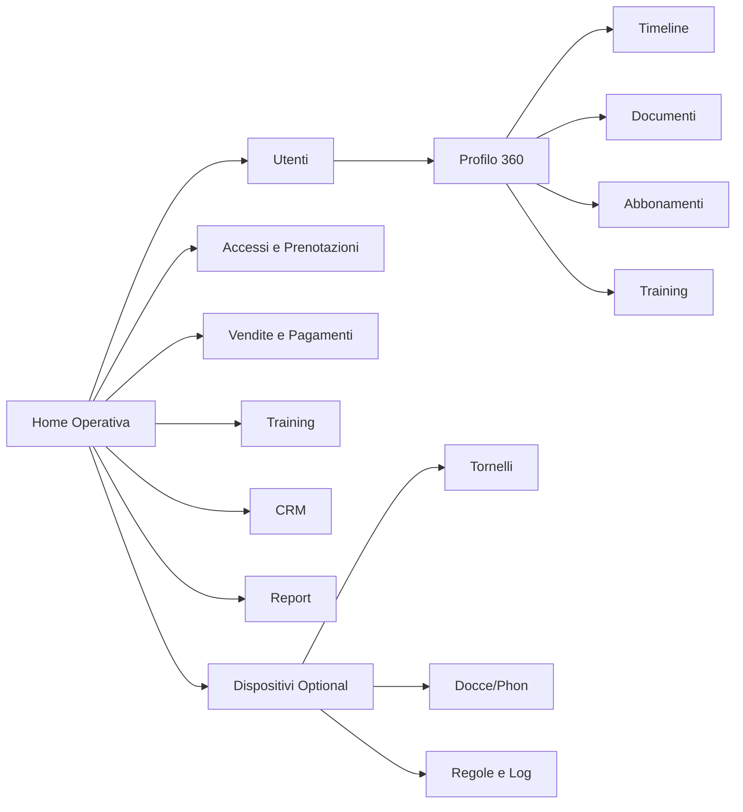

# Piano di Progettazione - Gestionale Palestre e Centri Sportivi

## 1) Obiettivo
Progettare una piattaforma unica con:
- Dashboard web per staff (amministrazione, reception, coach, manager, marketing).
- App mobile per utenti finali e staff (azioni rapide operative).
- Moduli opzionali IoT (tornelli, docce, phon, varchi) con controllo remoto e tracciamento.

## 2) Cosa tenere e cosa ottimizzare (dal gestionale esistente)
### Punti validi da mantenere
- Ampiezza funzionale: utenti, training, documenti, pagamenti, CRM, accessi.
- Profilo utente a 360° (timeline + documenti + abbonamenti + training).
- Funzioni operative immediate (es. “Sblocca tornello”).

### Criticità riscontrate negli screenshot
- Navigazione molto densa: troppi item e sotto-menu sempre visibili.
- Gerarchia visiva poco coerente (troppe azioni con stesso peso).
- Pagine form molto lunghe e frammentate in box non prioritizzati.
- Azioni critiche (incasso, blocco accesso, rinnovo) non sempre in primo piano.
- Esperienza mobile non chiaramente separata tra utente e staff rapido.

## 3) Principi di redesign
- **Ruolo-centrico**: ogni ruolo vede home, KPI e azioni diverse.
- **Task-first**: evidenza ad azioni frequenti (check-in, rinnovo, prenotazione, pagamento, certificati).
- **Progressive disclosure**: dettaglio solo quando serve (drawer/modali contestuali).
- **UI consistente**: pattern unificati per tabelle, form, filtri, stati, notifiche.
- **Omnicanale reale**: web per gestione completa, mobile per uso quotidiano e operazioni rapide.

## 4) Architettura moduli (Core + Optional)

### Core obbligatorio
1. **Anagrafiche e Membership**
2. **Abbonamenti, Vendite, Pagamenti, Fatture/Ricevute**
3. **Accessi e Prenotazioni Corsi/Servizi**
4. **Training (schede, modelli, progressi)**
5. **Documenti e Consensi (certificati, contratti, firme)**
6. **CRM e Comunicazioni (campagne, reminder, notifiche push/email/SMS/WhatsApp)**
7. **Analytics e Report**
8. **Impostazioni Club (sedi, operatori, permessi, branding)**

### Moduli opzionali
1. **IoT Access Control**: tornelli, varchi, docce, phon, armadietti.
2. **E-commerce**: vendita online di abbonamenti e prodotti.
3. **Gamification e loyalty**.
4. **BI avanzata e forecast churn**.

## 5) Ruoli e permessi (RBAC)
| Ruolo | Accessi principali | Restrizioni consigliate |
|---|---|---|
| Amministratore | Tutti i moduli + configurazioni globali | Nessuna |
| Club Manager | KPI, vendite, CRM, utenti, training, report | No gestione tecnica infrastruttura |
| Reception | check-in, anagrafica, vendite, prenotazioni, incassi | No permessi avanzati e no cancellazioni massive |
| Coach/PT | profili assegnati, schede, misure, presenze corsi | No dati finanziari completi |
| Marketing/CRM | campagne, segmenti, funnel | No modifica contratti/pagamenti |
| Operatore tecnico | dispositivi IoT, controller, log varchi | No dati sensibili cliente |
| Utente app | prenotazioni, scheda, pagamenti, documenti, QR accesso | Solo dati personali |

Regole consigliate:
- Permessi a granularità **azione** (`read`, `create`, `update`, `approve`, `refund`, `unlock_device`).
- Audit obbligatorio su azioni critiche (sblocco manuale, rimborsi, override accessi).
- Policy per sede/filiale (scope multi-club).

## 6) Struttura dashboard web (staff)

### Layout globale
- **Sidebar modulare** (collassabile): Home, Utenti, Accessi, Vendite, Training, CRM, Report, Dispositivi, Impostazioni.
- **Top bar**: ricerca globale, selettore sede, notifiche, attività recenti, utente.
- **Area centrale**: widget KPI + coda operativa + viste tabellari/card.
- **Pannello destro opzionale**: alert in tempo reale (certificati scaduti, accessi negati, disdette).

### Schermate principali
1. **Home Operativa**
- KPI: accessi oggi, incassi, rinnovi in scadenza, prenotazioni prossime 2h.
- “To-do rapido”: certificati da verificare, pagamenti falliti, richieste disdetta.

2. **Utente 360**
- Header profilo + stato abbonamento + badge accesso.
- Tab standard: Timeline, Abbonamenti, Pagamenti, Documenti, Training, Prenotazioni, Dispositivi/Accessi.
- Quick actions sticky: Nuova vendita, Rinnovo, Registra accesso, Sblocca varco.

3. **Training Studio**
- Modelli scheda, builder visuale esercizi/circuiti/superserie.
- Preview stampa/PDF e invio diretto in app.

4. **Dispositivi (optional IoT)**
- Mappa controller e stato online/offline.
- Comandi manuali con doppia conferma (es. apri tornello, abilita doccia).
- Log eventi e regole (tempo massimo, crediti, prenotazione richiesta).

## 7) Struttura app mobile

### Navigazione base (utente)
- Bottom nav: **Home**, **Prenota**, **Allenamento**, **Wallet**, **Profilo**.
- Home: QR accesso, stato abbonamento, prossima lezione, reminder certificato.
- Prenota: calendario corsi con filtri e disponibilità live.
- Allenamento: scheda giornaliera, video esercizi, tracking completamento.
- Wallet: pagamenti, ricevute, rinnovo rapido, crediti servizi.

### Modalità Staff Rapida (mobile)
- Accesso tramite switch ruolo.
- Azioni prioritarie: scansiona QR, check-in manuale, sblocco tornello/docce, verifica documenti, incasso rapido.
- UI “one-hand”: bottoni grandi e feedback immediato (successo/errore).

## 8) Flussi chiave da progettare subito
1. **Nuovo iscritto**: lead -> anagrafica -> contratto/consensi -> pagamento -> attivazione accesso -> onboarding app.
2. **Check-in**: validazione titolo -> eventuale consumo credito -> apertura varco -> log evento.
3. **Rinnovo in scadenza**: trigger automatico -> notifica -> proposta rinnovo -> pagamento -> aggiornamento titolo.
4. **Piano allenamento**: assegnazione modello -> personalizzazione -> pubblicazione app -> monitor progresso.
5. **Gestione certificato medico**: upload/validazione -> reminder automatico -> blocco accesso condizionato.

## 9) Integrazione tornelli/docce (modulo optional)

### Componenti
- **Device Gateway** (driver vendor-specific).
- **Rule Engine** (chi può aprire cosa, quando, con quali prerequisiti).
- **Command Service** (invio comandi idempotenti, timeout, retry controllato).
- **Event Logger** (audit completo con utente, ruolo, dispositivo, motivo).

### Regole minime consigliate
- Sblocco manuale solo a ruoli autorizzati e con motivazione obbligatoria.
- Comandi remoti con scadenza breve (token TTL 15–30 sec).
- Fallback operativo: se controller offline, procedura manuale tracciata.
- Distinzione “apertura tecnica” vs “ingresso addebitato”.

## 10) Modello dati ad alto livello
- `User`, `Role`, `Membership`, `AccessPass`, `VisitEvent`
- `Booking`, `CourseSession`, `TrainerAssignment`
- `WorkoutPlan`, `WorkoutExecution`, `Measurement`
- `Invoice`, `Payment`, `Product`, `ServiceCredit`
- `Document`, `Consent`, `MedicalCertificate`
- `Device`, `DeviceCommand`, `DeviceEvent`, `AutomationRule`

## 11) Roadmap di rilascio
1. **Fase 1 (MVP - 10/12 settimane)**: anagrafiche, vendite, accessi, prenotazioni, dashboard base, app utente base.
2. **Fase 2**: training avanzato, CRM, documenti/consensi evoluti, reportistica completa.
3. **Fase 3**: modulo IoT completo (tornelli/docce/phon), automazioni avanzate, BI predittiva.

## 12) KPI di qualità prodotto
- Tempo medio check-in (< 5 sec).
- Riduzione accessi negati impropri.
- Tasso rinnovo automatico/assistito.
- Riduzione no-show prenotazioni.
- Tempo medio operazione reception (nuova vendita, modifica profilo, sblocco dispositivo).

## 13) Mappa informativa proposta

---
File mockup associati:
- `mockups/dashboard-web.html`
- `mockups/mobile-app.html`
